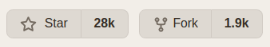

Ahoj Martine, k tomu webovému frameworku, o kterém jsem se zmínil na poradě, jsem ti sepsal nějaké informace:


## FastAPI

[FastAPI framework](https://fastapi.tiangolo.com/) &ndash; 28k stars na [GitHub](https://github.com/tiangolo/fastapi).



>FastAPI is a modern, fast (high-performance), web framework for building APIs with Python 3.6+ based on standard Python type hints.


Můžeme vytvářet různé odpovědi na požadavky dle url adresy a argumentů v adrese. Vracíme JSON nebo HTML, viz níže.

Experimentálně spuštěno na `http://www.dwhdev.cz:5006`:

* automaticky generovaná dokumentace

    <http://dwhdev.vsb.cz:5006/docs>

* Hello World

    <http://dwhdev.vsb.cz:5006/>

    <http://dwhdev.vsb.cz:5006/ping>

* JSON podle argumentů v url

    <http://dwhdev.vsb.cz:5006/publikace/LES05>


* tabulka (HTML) podle argumentů v url

    <http://dwhdev.vsb.cz:5006/publikace_tab/LES05?q=2>

    <http://dwhdev.vsb.cz:5006/publikace_tab2/LES05?q=999>

* vizualizace (HTML) podle argumentů v url

    <http://dwhdev.vsb.cz:5006/publikace_viz/sna57?q=42>


Jednoduchá funkce pro jeden route vypadá např. takto:
```python
@app.get("/publikace_tab/{emp_id}")
async def publikace_tab(emp_id: str, q: Optional[int] = 12):
    '''Vrátí SQL dotaz jako HTML stránku s HTML tabulkou.'''
    
    conn = pres_connect('pres_dm_scientometrie')
    sql = f'select * from fact_biblio where "AUTOR_OSOBNI_CISLO" = \'{emp_id.upper()}\' limit {q};'
    df = pd.read_sql_query(sql=sql, con=conn)
    conn_close(conn)

    html_content = df.to_html()
    return HTMLResponse(content=html_content, status_code=200)
```


## Vizualizace

Pro vizualizace jsem použil [HoloViz](https://holoviz.org/), resp. [HoloViews](https://holoviews.org/). Využívá (nejen) knihovnu [Bokeh](https://bokeh.org/).

Demo např. zde:

* <https://demo.bokeh.org/stocks>
* <https://examples.pyviz.org/portfolio_optimizer/portfolio.html#portfolio-optimizer-gallery-portfolio>
