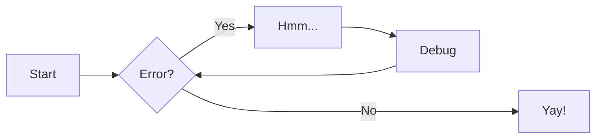
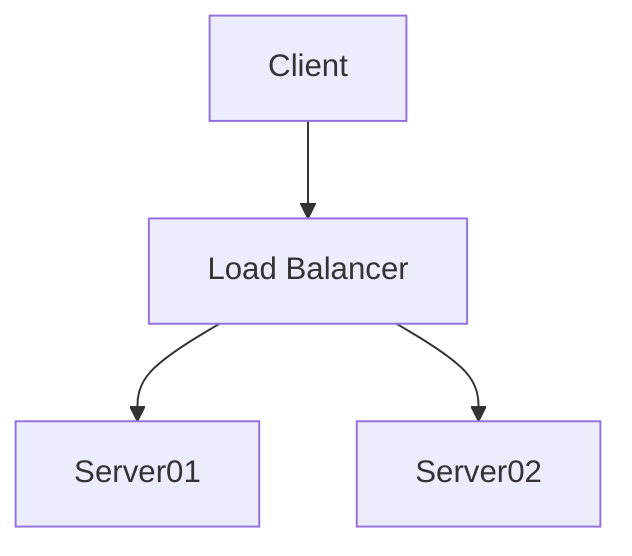

<!-- filen-name může být i index.md; při buildu se README.md vyrenderuje pod názvem index.html -->

# Úvod

Cílem dokumentu je popsat architekturu repozitáře vyplývající ze [Strategického záměru VŠB 2021-2027](https://vsb.cz/xxxxxxxxxxxxxxxxxx). 


[Introduction - PyMdown Extensions Documentation](https://facelessuser.github.io/pymdown-extensions/)

[mermaid - Markdownish syntax for generating flowcharts, sequence diagrams, class diagrams, gantt charts and git graphs.](https://mermaid-js.github.io/mermaid/#/)





!!! failure "Selhání"
    Lorem ipsum dolor sit amet, consectetur adipiscing elit. Nulla et euismod
    nulla. Curabitur feugiat, tortor non consequat finibus, justo purus auctor
    massa, nec semper lorem quam in massa.

    `Lorem cillum culpa pariatur deserunt excepteur Lorem est culpa excepteur incididunt!`

!!! note "Poznámka"
    Lorem ipsum dolor sit amet, consectetur adipiscing elit. Nulla et euismod
    nulla. Curabitur feugiat, tortor non consequat finibus, justo purus auctor
    massa, nec semper lorem quam in massa.

    ``` python
    def bubble_sort(items):
        for i in range(len(items)):
            for j in range(len(items) - 1 - i):
                if items[j] > items[j + 1]:
                    items[j], items[j + 1] = items[j + 1], items[j]
    ```

    Nunc eu odio eleifend, blandit leo a, volutpat sapien. Phasellus posuere in
    sem ut cursus. Nullam sit amet tincidunt ipsum, sit amet elementum turpis.
    Etiam ipsum quam, mattis in purus vitae, lacinia fermentum enim.


[Sekce B](2.md#sekce-b)

a -- b, 'fdsa', "asdf"
## title 1

    mkdocs.yml    # The configuration file.
    docs/
        index.md  # The documentation homepage.
        ...       # Other markdown pages, images and other files.

```python
def fn():
    pass
```

```bash
echo Hello World!
ls -al
```

## title 2

First Header | Second Header | Third Header
------------ | ------------- | ------------
Content Cell | Content Cell  | Content Cell
Content Cell | Content Cell  | Content Cell

*Specify alignment for each column by adding colons to separator lines:*

First Header | Second Header | Third Header
:----------- |:-------------:| -----------:
Left         | Center        | Right
Left         | Center        | Right

Tempor proident veniam irure proident esse ad ad occaecat labore sint nulla. Sint ipsum amet ex dolor sit sint eu. Dolore aliquip occaecat fugiat et fugiat. Nulla nisi ea proident officia reprehenderit est. Qui do aute ex minim deserunt ut cupidatat laboris qui excepteur tempor ut.

Commodo laborum in deserunt in eiusmod aliquip. Elit pariatur minim labore irure id. Et ipsum elit sunt ex elit. Exercitation in amet reprehenderit voluptate occaecat eu.

---

Více [o projeku](about.md).
